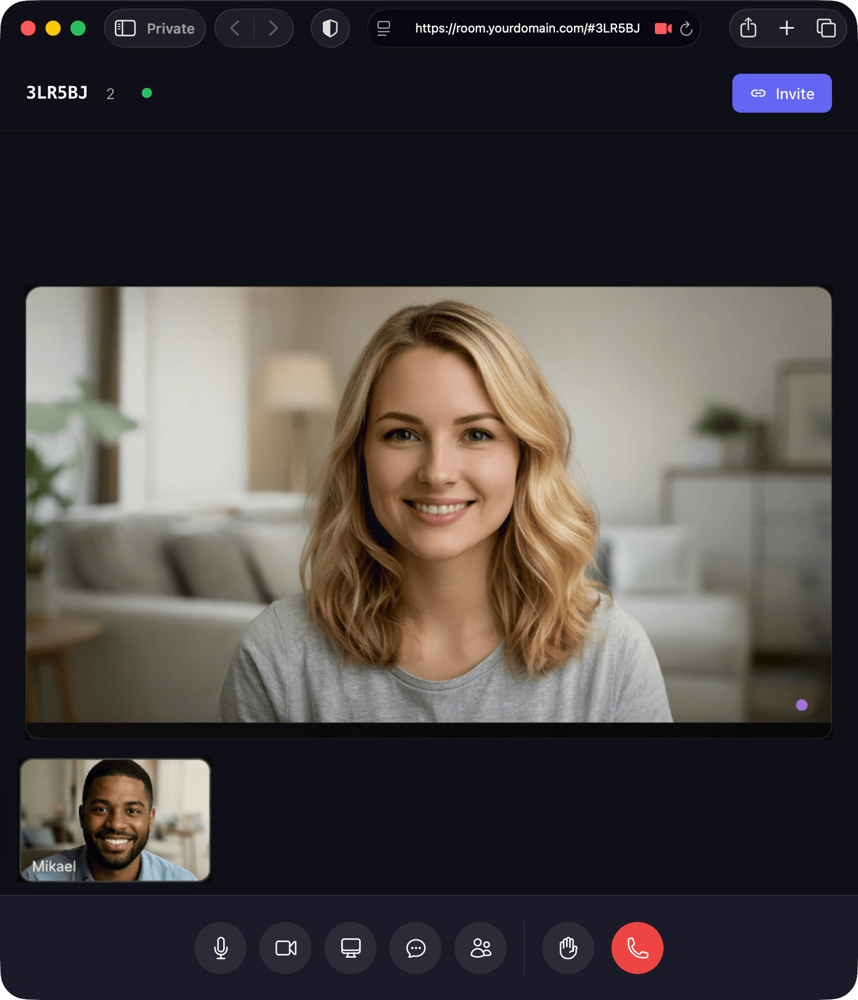

# MikroRoom


**The minimalist video meeting app that's all yours.**

The ultralight, self-hosted video conferencing platform for teams who want freedom over their meetings.

MikroRoom is a self-hosted video conferencing solution that prioritizes simplicity and performance. Built with vanilla TypeScript and Node.js, it provides everything you need for video meetings without the overhead of heavy frameworks. This allows MikroRoom to run with incredibly modest hardware and becomes a cost- and performance-efficient way to do fully private (and sovereign!) video conferencing.


[](https://opensource.org/licenses/MIT)



## Features

- **Zero Dependencies**: Pure Node.js + TypeScript with no runtime dependencies
- **Modern Vanilla Stack**: No React or other frameworks, just HTML/CSS and TS that compiles to JS
- **Super fast loads**: ~25KB transfer size for the client app means it works on any connection
- **Modern UX**: Looks and behaves like you'd expect of a modern app
- **WebRTC**: Native Peer-to-peer video/audio with efficient signaling
- **Self-Hosted**: Full control over your data and infrastructure
- **Production-Ready**: Built-in security, rate limiting, etc.

## Quick Start

### Production (recommended)

Install the CLI with a single command, then download and run MikroRoom:

```bash
# Install CLI
curl -sSL https://releases.mikroroom.com/install.sh | bash

# Install MikroRoom
mikroroom install

# Initialize in your project directory
mkdir my-meeting && cd my-meeting
mikroroom init

# Start the server
mikroroom start

# In a second terminal, run the frontend app
npx http-server app -p 8000
```

Then open `http://localhost:8000` in your browser.

### Download release

Download the [latest release](https://releases.mikroroom.com/mikroroom_latest.zip), extract it, and deploy:

- `api/mikroroom.mjs` — run with `node mikroroom.mjs` on your server
- `app/` — deploy to any static host or serve with a reverse proxy

## Configuration

MikroRoom works out of the box with zero configuration! However, you may want to configure:

- **API URL** - When hosting frontend separately from backend
- **STUN/TURN servers** - For better connectivity behind NAT/firewalls
- **HTTPS/SSL** - Required for production and camera access
- **Port** - Custom port number

See [CONFIGURATION.md](./CONFIGURATION.md) for detailed setup instructions.

### Quick Configuration

**1. Frontend Runtime Config** (for API URL, ICE servers):
Edit `static/mikroroom.config.json`:

```json
{
  "apiUrl": "wss://api.yourdomain.com/ws",
  "iceServers": [
    { "urls": "stun:stun.cloudflare.com:3478" }
  ]
}
```

**2. Server Environment Config** (for port, HTTPS, TURN):
Create a `.env` file:

```bash
PORT=8080
TURN_SERVER_URL=turn:your-turn-server.com:3478
TURN_SERVER_USERNAME=your-username
TURN_SERVER_CREDENTIAL=your-password
```

## See docs site for more

Visit [the docs site](https://docs.mikroroom.com) to get much more detailed instructions.

## License

MIT. See the [LICENSE](LICENSE) file.
